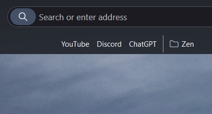

# Bookmark Toolbar Tweaks

This theme provides comprehensive customization options for the bookmarks toolbar with enhanced transparency and auto-hide features.

## Features

### **Layout & Positioning**

- **Center the toolbar** - Center bookmarks in the toolbar
- **Toolbar direction** - Set left-to-right or right-to-left layout

### **Icon & Text Management**

- **Hide folder icons** - Remove folder icons from bookmark folders
- **Hide website icons** - Remove favicons from bookmark items
- **Hide bookmark names** - Show only icons without text labels

### **Transparency & Visual Effects**

- **Default transparent background** - Bookmarks toolbar has a transparent background by default
- **Enhanced transparent effects** - Additional transparency effects with hover animations and styled popup menus

### **Auto-Hide Functionality**

- **Auto-hide: Expand by hovering** - Hide toolbar and show on hover (only works when bookmarks toolbar is enabled)
- **Auto-hide: Expand when searching** - Hide toolbar and show when focusing the address bar
- **Smart detection** - Auto-hide features automatically disable when bookmarks toolbar is turned off

## Usage

Each setting can be enabled individually through the theme's configuration panel in Zen Browser settings.

**To enable the bookmarks toolbar:** Press `Ctrl + Shift + B` (or `Cmd + Shift + B` on Mac)

## Compatibility

- Fully compatible with Zen Browser's bookmark management
- Works with all bookmark folder structures
- Maintains functionality of bookmark drag & drop
- Preserves all native bookmark features
